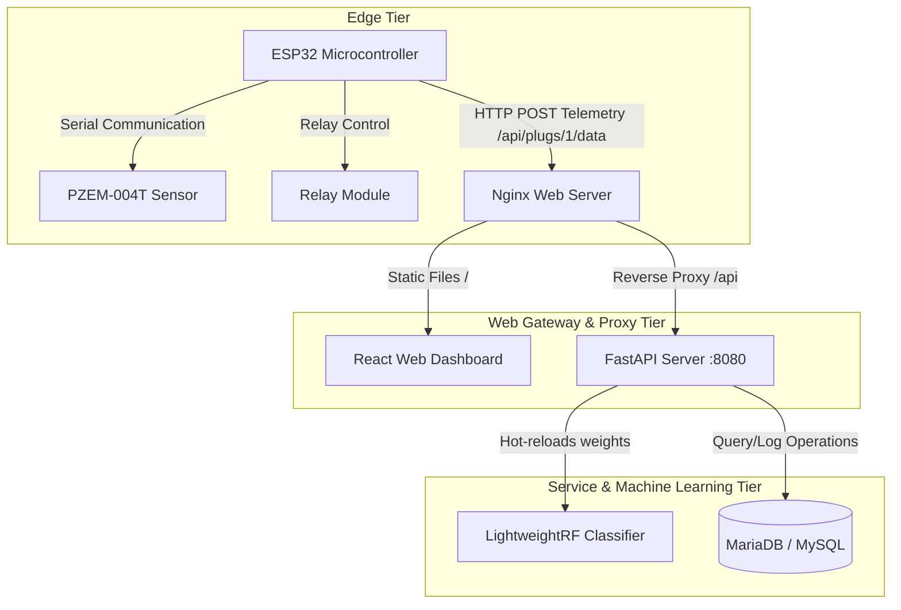

# Smart Outlet: Production Deployment & Architecture Guide

Welcome to the production deployment guide for the **Smart Outlet System**. This document outlines the full end-to-end architecture of the platform and provides step-by-step instructions to transfer and deploy the entire solution onto a Raspberry Pi for 24/7 background hosting.

---

## 1. End-to-End System Architecture

The Smart Outlet Platform operates on a highly reliable **4-Tier Architecture** that bridges real-world telemetry, machine learning, relational database history, and responsive web visualization:



### Components Breakdown:
1. **Edge Tier**:
   - **PZEM-004T Sensor**: Reads live AC voltage (Vrms), current (Irms), active power (Watts), and power factor (PF).
   - **ESP32 Microcontroller**: Queries PZEM, runs predictive safety logic, manages local relays, and streams HTTP JSON payloads to the web server every 5 seconds.
2. **Gateway & Web Tier (Nginx)**:
   - Serves the built React application (HTML/CSS/JS) to client browsers.
   - Acts as a reverse proxy, mapping all `/api` traffic seamlessly to the local FastAPI backend.
3. **Application & ML Tier (FastAPI)**:
   - Coordinates plug nodes state, controls outlet toggling, and queries logs.
   - Integrates a custom **Lightweight Random Forest Classifier** (30 Trees, max depth of 10) built with pure Python/JS matrix arithmetic. It predicts device loads (`Phone`, `Laptop`, `Fan`, `Idle`) in microseconds and automatically hot-reloads retrained weight updates from `model.json` without downtime.
   - Calculates exact, time-elapsed energy increments:
     $$\Delta \text{kWh} = \frac{\text{Power (W)} \times \Delta t \text{ (seconds)}}{3600 \times 1000}$$
4. **Data Persistence Tier (MariaDB)**:
   - `plugs` table: Holds live state and active load predictions.
   - `system_stats` table: Tracks accumulated Daily, Weekly, and Monthly consumption.
   - `telemetry_logs` table: Stores fine-grained historical telemetry entries for audit trails.

---

## 2. Raspberry Pi Prerequisites

Before starting, ensure your Raspberry Pi is configured with a **Static IP address** on your router (e.g. `192.168.1.150`).

Log into your Raspberry Pi via SSH and install the system dependencies:
```bash
sudo apt update && sudo apt upgrade -y
sudo apt install -y mariadb-server python3-venv python3-pip git nginx nodejs npm
```

---

## 3. Workspace Transfer

Transfer the codebase from your Windows environment to the Raspberry Pi:

* **Method A: Git Clone (Recommended)**
  Push your local changes to a repository, then clone it directly onto the Pi:
  ```bash
  git clone https://github.com/yourusername/smart-outlet.git ~/smart-outlet
  ```

* **Method B: Secure Copy (SCP)**
  From Windows PowerShell:
  ```powershell
  scp -r "C:\Users\G18\Desktop\Projects\Smart Outlet" pi@<PI_IP_ADDRESS>:~/smart-outlet
  ```

---

## 4. Database Setup (MariaDB)

1. Run the secure installation routine:
   ```bash
   sudo mysql_secure_installation
   ```
2. Log into the database prompt as root:
   ```bash
   sudo mysql -u root -p
   ```
3. Run the following queries to create the database and set up access permissions:
   ```sql
   CREATE DATABASE IF NOT EXISTS smartoutlet;
   CREATE USER IF NOT EXISTS 'smart_user'@'localhost' IDENTIFIED BY 'your_secure_password';
   GRANT ALL PRIVILEGES ON smartoutlet.* TO 'smart_user'@'localhost';
   FLUSH PRIVILEGES;
   EXIT;
   ```
4. Create a `.env` configuration file in `~/smart-outlet/server/` on the Pi:
   ```env
   MARIADB_HOST=127.0.0.1
   MARIADB_PORT=3306
   MARIADB_USER=smart_user
   MARIADB_PASS=your_secure_password
   MARIADB_DB=smartoutlet
   ```

---

## 5. Hosting the FastAPI Backend in the Background (Systemd)

To make sure the API remains online across sessions, reboots, and network dropouts, run it as a Systemd service daemon:

1. Navigate to the server folder and set up a virtual environment:
   ```bash
   cd ~/smart-outlet/server
   python3 -m venv venv
   source venv/bin/activate
   pip install --upgrade pip
   pip install -r requirements.txt uvicorn
   ```
2. Create the systemd service file:
   ```bash
   sudo nano /etc/systemd/system/smart-outlet-api.service
   ```
3. Paste the following configuration:
   ```ini
   [Unit]
   Description=Smart Outlet FastAPI Backend Service
   After=network.target mariadb.service

   [Service]
   User=pi
   WorkingDirectory=/home/pi/smart-outlet/server
   ExecStart=/home/pi/smart-outlet/server/venv/bin/uvicorn main:app --host 127.0.0.1 --port 8080
   Restart=always
   RestartSec=5
   Environment=PYTHONUNBUFFERED=1

   [Install]
   WantedBy=multi-user.target
   ```
4. Enable and start the daemon:
   ```bash
   sudo systemctl daemon-reload
   sudo systemctl enable smart-outlet-api
   sudo systemctl start smart-outlet-api
   ```
5. Check that the service is running successfully:
   ```bash
   sudo systemctl status smart-outlet-api
   ```

---

## 6. Hosting the React Frontend (Nginx with Reverse Proxy)

Vite's default development server is not designed for production environments. Instead, compile the app to static assets and serve them via Nginx, utilizing a reverse proxy for all API traffic to eliminate CORS issues.

1. Build the Vite application:
   ```bash
   cd ~/smart-outlet
   npm install
   npm run build
   ```
2. Clear the default Nginx web root and copy the compiled production assets:
   ```bash
   sudo rm -rf /var/www/html/*
   sudo cp -r dist/* /var/www/html/
   ```
3. Configure the Nginx virtual host with the reverse proxy rule:
   ```bash
   sudo nano /etc/nginx/sites-available/default
   ```
4. Replace the contents of the file with the following server block:
   ```nginx
   server {
       listen 80;
       server_name _;

       root /var/www/html;
       index index.html;

       location / {
           try_files $uri $uri/ /index.html;
       }

       # Route all api calls to the local FastAPI background daemon
       location /api {
           proxy_pass http://127.0.0.1:8080;
           proxy_http_version 1.1;
           proxy_set_header Upgrade $http_upgrade;
           proxy_set_header Connection 'upgrade';
           proxy_set_header Host $host;
           proxy_cache_bypass $http_upgrade;
       }
   }
   ```
5. Test the Nginx syntax and reload the server:
   ```bash
   sudo nginx -t
   sudo systemctl restart nginx
   ```

The dashboard is now instantly accessible at `http://<YOUR_PI_IP_ADDRESS>/` from any device connected to your local network!

---

## 7. Update and Flash the ESP32 Firmware

Before deploying the hardware:
1. Open the [esp32.ino](file:///c:/Users/G18/Desktop/Projects/Smart%20Outlet/esp32.ino) file on your development PC.
2. Locate the backend endpoint URL definition (usually around line 9):
   ```cpp
   const char* serverName = "http://172.20.10.6:8080/api/plugs/1/data";
   ```
3. Replace `172.20.10.6:8080/api/plugs/1/data` with your Raspberry Pi's new production endpoint URL (Notice Nginx reverse proxy routes this directly through port 80 now!):
   ```cpp
   const char* serverName = "http://<YOUR_PI_IP_ADDRESS>/api/plugs/1/data";
   ```
4. Connect your ESP32 board, select the correct COM port and board configuration in Arduino IDE, and click **Upload** (Flash).

The system is now fully deployed and running a secure, hardware-accelerated, machine-learning-driven multi-outlet telemetry log console in a 24/7 self-healing production state!